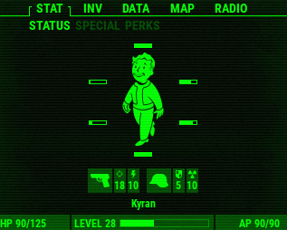
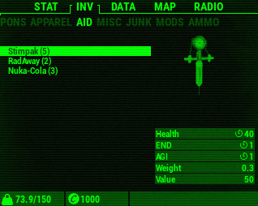

# PipBoy Pygame Project

[](https://www.python.org/)
[](https://opensource.org/licenses/MIT)

> A Pip-Boy inspired application built with Python and Pygame

---

## Table of Contents

- [Introduction](#introduction)
- [Features](#features)
- [Installation](#installation)
- [Usage](#usage)
- [Screenshots](#screenshots)
- [Contributing](#contributing)
- [License](#license)
- [Contact](#contact)

---

## Introduction

The **PipBoy Pygame Project** is an interactive application inspired by the iconic Pip-Boy interface from the *Fallout* series. Built using [Pygame](https://www.pygame.org/news), this project simulates various aspects of the Pip-Boy interface, including interactive menus, inventory displays, and dynamic UI elements. It is designed both as a fun project and as a learning tool for Python game development.

I have used the great pipboy project from [Zapwizard](https://github.com/zapwizard/pypboy), but this entire project is built from the ground up.

---

## Features

- **Retro UI Design:** Inspired by the classic Pip-Boy interface with a modern twist.
- **Interactive Menus:** Navigate through different screens such as inventory, stats, and map.
- **Customizable Modules:** Easily add or modify modules (e.g., radio, stats, inventory) to suit your needs.

---

## Installation

### Prerequisites

- **Python 3.12 or later:** [Download Python](https://www.python.org/downloads/)
- **Pygame:** This project uses Pygame for its graphical interface.
- **Optional: Pip** to install dependencies from `requirements.txt`.

### Steps

It is recommended to first run the project on your windows machine to ensure everything works as expected. Here are the steps to get started:

1. **Clone the Repository:**

   ```bash
   git clone https://github.com/kelmes1/pipboy-pi.git
   cd pipboy-pi
   ```

2. **Install Dependencies:**

   ```bash
   pip install -r requirements.txt
   ```

3. **Run the Application:**

   ```bash
   python modules/main.py
   ```

---

## Usage

Once you have installed all the prerequisites and dependencies, running the project is straightforward. Here are some usage tips:

- **Navigation:** Use your keyboard (or mapped controller keys) to navigate through the Pip-Boy interface.
- **Modules:** Switch between different modules like Inventory, Stats, or Map using the on-screen prompts.
- **Customization:** Modify the settings with `configure.py` to change UI themes, key bindings, or module behavior.

---

## Screenshots

Here are some snapshots of the project in action:



*The main Pip-Boy interface with navigation options.*



*Example of the interactive inventory module.*

---

## Contributing

Contributions are welcome! If you'd like to contribute to the project, please follow these guidelines:

1. **Fork the Repository:** Click on the "Fork" button on GitHub to create your own copy.
2. **Create a Branch:** Develop your features or bug fixes on a separate branch.
  
   ```bash
   git checkout -b feature/my-new-feature
   ```

3. **Commit Changes:** Write clear, concise commit messages.
4. **Push Your Branch:**

   ```bash
   git push origin feature/my-new-feature
   ```

5. **Submit a Pull Request:** Open a pull request with a description of your changes and the problem it solves.

For major changes, please open an issue first to discuss what you would like to change.

---

## License

This project is licensed under the MIT License. See the [LICENSE](LICENSE) file for more information.

---

## Contact

For any questions, suggestions, or bug reports, feel free to reach out:

- **GitHub Issues:** Use the [Issues](https://github.com/kelmes1/pipboy-pi/issues) page to report bugs or request features.
- **Email:** [kelmesart@gmail.com](mailto:kelmesart@gmail.com)
